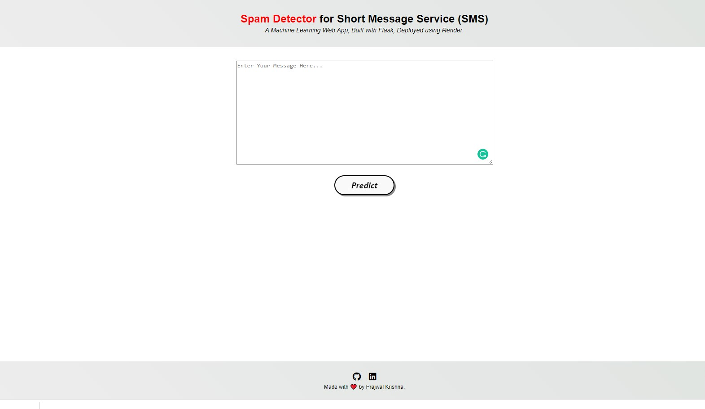

# Spam SMS Classification - Deployment
  

• This repository consists of files required to deploy a ___Machine Learning Web App___ created with ___Flask___ on ___Render___ platform.

• If you want to view the deployed model, click on the following link: 
Deployed at: 

• Please do ⭐ the repository, if it helped you in anyway.

• A glimpse of the web app:

